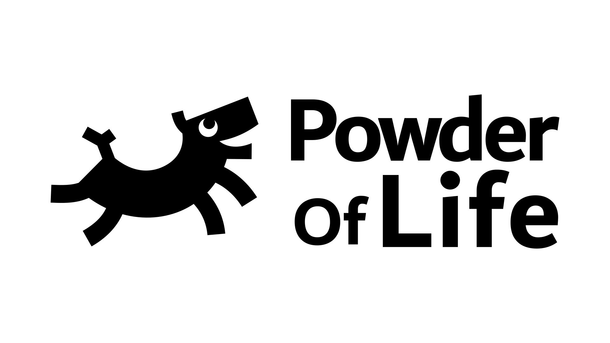

# Powder Of Life

## Introduction

Welcome! Glad you could stop by.

### What is Powder Of Life?

Powder Of Life (POL) is a framework for building things. You can create musical instruments, autonomous robots, oversized interfaces, interactive sculptures, or whatever other weird thing your heart desires. POL allows you to connect components together easily and get robust, predictable behavior.

Feel free to [check out my socials via my website](https://andrewfrueh.com) to see the kinds of things I'm making with POL (i.e. why I put in the endless hours it takes to build all this).

### Is there documentation?

Yes. It's a work in progress, but I'm building the docs.

[Documentation](Documentation/)

#### API

[Check out the API](Documentation/API)

## How do I get started?

### For the Arduino environment

Download the Arduino library ZIP file and install it on your system:

[Powder Of Life, Arduino library](Arduino/PowderOfLife.zip)

The library comes with example projects including the projects featured above in the intro.

#### Okay, but how do I install an Arduino library?

If you are not familiar with how to install an Arduino library, more info can be found here:

https://www.arduino.cc/en/guide/libraries

## How do I contribute code?

You can't. All pull requests will be ignored. Unfortunately, GitHub does not currently allow us to disable PRs. See [Dear GitHub #84](https://github.com/dear-github/dear-github/issues/84) and quietly fume...

However, issues and feature requests are fine. And of course, per the license, you are welcome to modify and further distribute this software.

To [quote Ben Johnson](https://changelog.com/news/open-source-but-closed-to-contributions-jGyl), 
>I am grateful for community involvement, bug reports, & feature requests. I do not wish to come off as anything but welcoming, however, I’ve made the decision to keep this project closed to contributions for my own mental health and long term viability of the project.

... I hope you understand.

---

## License for software in all environments

Powder Of Life, Copyright (C) Andrew Frueh, 2018-2024
Powder Of Life is under the GNU General Public License. See "LICENSE.txt" file.

---

## Graphics and Logos

All graphics, logos are under Creative Commons Attribution-NonCommercial-ShareAlike 4.0 International (CC BY-NC-SA 4.0)
https://creativecommons.org/licenses/by-nc-sa/4.0/

---

## Parts and Mechanical Designs

All all 2D parts, 3D parts, and related design files are under Creative Commons Attribution-NonCommercial-ShareAlike 4.0 International (CC BY-NC-SA 4.0)
https://creativecommons.org/licenses/by-nc-sa/4.0/
