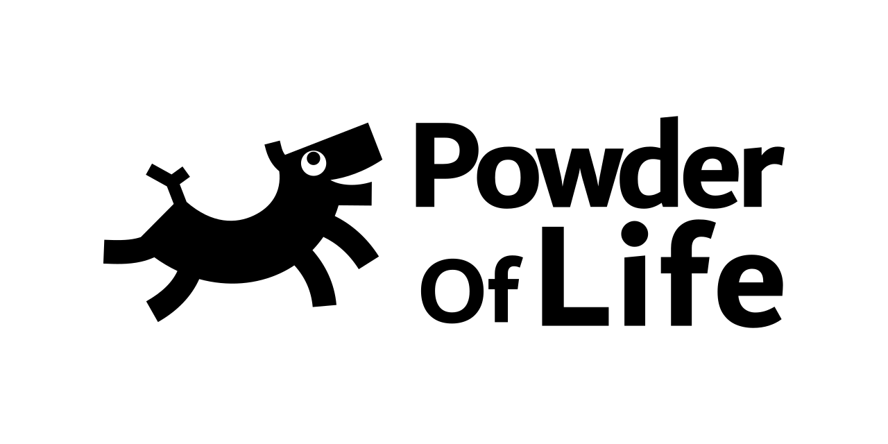
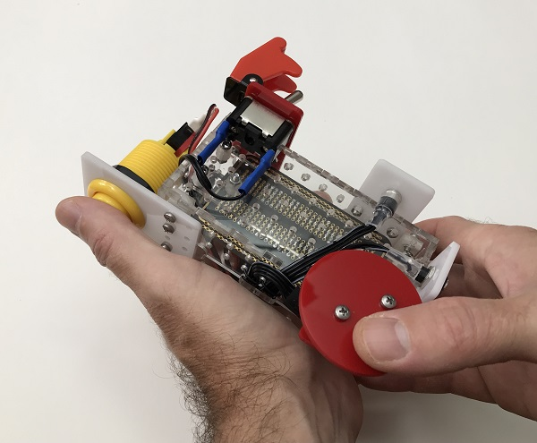
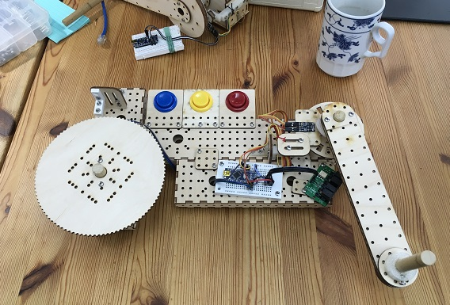
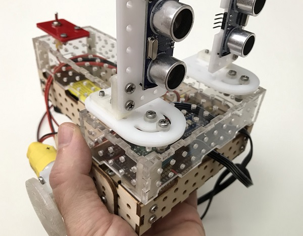

# Powder Of Life

A neural-network-framework for building interactive and autonomous analog robots.

## Introduction

Welcome! Glad you could stop by.

### What is Powder Of Life?

#### We're not in Kansas anymore

This fantastic name comes from <a href="https://en.wikipedia.org/wiki/The_Marvelous_Land_of_Oz" target="_blank">L. Frank Baum's Oz series</a>. If you sprinkle the powder on something, and say the magic words, the inanimate object will come to life. 

#### Sure... but what is *this*

Powder Of Life *(POL)* is a framework for building things. You can create musical instruments, autonomous robots, oversized interfaces, interactive sculptures, or whatever weird thing you design. POL allows you to connect components together without getting bogged down in the figity little bits of figuring out how to work with this sensor or that motor. You just connect the two together, and you will have a reacitve robot that responds to its evironment. 

I developed POL in response to both my own research and the needs of my students. It began as a collection of components that were developed from recurring problems in teaching new media art classes. Students in these classes are struggling through multiple specializations to achieve their goal (electrical, mechanical, and software engineering). I have found that my best contribution in that process is a simple, well-written script, properly compartmentalized to do a task well. These scripts eventually became the foundation of the Powder Of Life framework.

To see examples of how you might use POL, start by looking at my [personal website](https://andrewfrueh.com). It has links to all the places I post currently on social media, and you can see how I am currently using POL.

### Showcase / examples

Some of the artifacts I have created with POL (above) are also included with the Arduino library (below). While I cannot include the parts (if only we had replicators!), I have included the code that controls them so you can understand what is involved in those builds. Below are the included examples (listed under "Series_2_Showcase" in the POL Examples from the File menu in the Arduino IDE).

#### Tony

#### Kendrick

#### Valentino

## How do I get started?

To get up and running, just download the Arduino library ZIP file and install it on your system:

[Powder Of Life, Arduino library](Arduino/PowderOfLife.zip)

The library comes with example projects including the projects featured above in the intro.

### Okay, but how do I install an Arduino library?

If you are not familiar with how to install an Arduino library, more info can be found here:

https://www.arduino.cc/en/guide/libraries

## How do I contribute code?

You can't. Per the license, you are welcome to modify and further distribute this software. But to [quote Ben Johnson](https://changelog.com/news/open-source-but-closed-to-contributions-jGyl), 

>I am grateful for community involvement, bug reports, & feature requests. I do not wish to come off as anything but welcoming, however, I’ve made the decision to keep this project closed to contributions for my own mental health and long term viability of the project.

... I hope you understand.

## License

Powder Of Life, Copyright (C) Andrew Frueh, 2019-2021

Powder Of Life is free software: you can redistribute it and/or modify it under the terms of the
GNU General Public License as published by the Free Software Foundation, either version 3 of the
License, or (at your option) any later version.

Powder Of Life is distributed in the hope that it will be useful, but WITHOUT ANY WARRANTY;
without even the implied warranty of MERCHANTABILITY or FITNESS FOR A PARTICULAR PURPOSE.
See the GNU General Public License for more details.

You should have received a copy of the GNU General Public License along with Powder Of Life.
If not, see <https://www.gnu.org/licenses/>.

