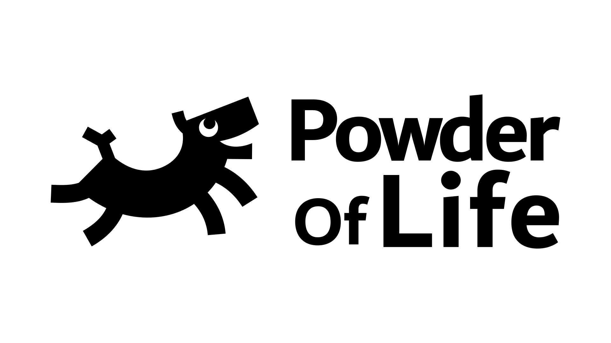

# Powder Of Life

## Introduction

Welcome! Glad you could stop by.

### What is Powder Of Life?

Powder Of Life (POL) is a framework for building things. You can create musical instruments, autonomous robots, oversized interfaces, interactive sculptures, or whatever other weird thing your heart desires. POL allows you to connect components together easily and get robust, predictable behavior.

Feel free to [check out my socials via my website](https://andrewfrueh.com) to see the kinds of things I'm making with POL (i.e. why I put in the endless hours it takes to build all this).

### Is there documentation?

Yes. It's a work in progress, but I'm building the docs.

[Check out the Documentation](Documentation/)

### Is there an API?

Yes. Also a work in progress

[Check out the API](Documentation/API)

## How do I get started?

### For the Arduino environment

Download the Arduino library ZIP file and install it on your system:

[Check out the Arduino library](Arduino/)

### For the Unity environment

Download the Unity package file and install it on your system:

[Check out the Unity package](Unity/)

## How do I contribute code?

You can't. All pull requests will be ignored. Unfortunately, GitHub does not currently allow us to disable PRs. See [Dear GitHub #84](https://github.com/dear-github/dear-github/issues/84) and quietly fume...

However, issues and feature requests are fine. And of course, per the license, you are welcome to modify and further distribute this software.

To [quote Ben Johnson](https://changelog.com/news/open-source-but-closed-to-contributions-jGyl), 
>I am grateful for community involvement, bug reports, & feature requests. I do not wish to come off as anything but welcoming, however, I’ve made the decision to keep this project closed to contributions for my own mental health and long term viability of the project.

... I hope you understand.

---

# Powder of Life

---

### Academic & Research Attribution
Powder of Life is designed to support modular innovation in research contexts. If this framework supports your research, publication, or patented technology, please provide attribution as follows:

**Preferred Citation:**
> Frueh, A. (2026). *Powder of Life: A Modular Framework for Robotics and Research Integration*. [Source Code]. https://github.com/andrewfrueh/PowderOfLife

**Short Form (for Grant Publications):**
> "The modular prototyping and system integration for this project were supported by the Powder of Life framework (Frueh, 2026)."