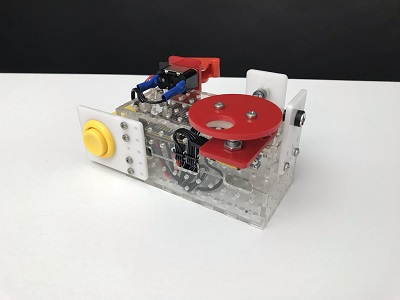
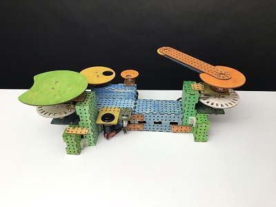
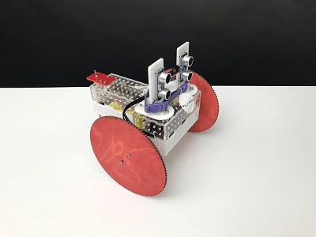

# Powder Of Life

A neural-network-framework for building interactive and autonomous analog robots.

## Introduction

Welcome! Glad you could stop by.

### What is Powder Of Life?

#### We're not in Kansas anymore

This fantastic name comes from [L. Frank Baum's Oz series](https://en.wikipedia.org/wiki/The_Marvelous_Land_of_Oz). If you sprinkle the powder on something, and say the magic words, the inanimate object will come to life. For example, the [Jack Pumpkinhead](https://en.wikipedia.org/wiki/Jack_Pumpkinhead) and the [Sawhorse](https://en.wikipedia.org/wiki/List_of_Oz_characters_(created_by_Baum)#Sawhorse).

#### Sure... but what is *this*

Powder Of Life *(POL)* is a framework for building things. You can create musical instruments, autonomous robots, oversized interfaces, interactive sculptures, or whatever weird thing you design. POL allows you to connect components together without getting bogged down in the figity little bits of figuring out how to work with this sensor or that motor. You just connect the two together, and you will have a reacitve robot that responds to its evironment. 

I developed POL in response to both my own research and the needs of my students. It began as a collection of components that were developed from recurring problems in teaching new media art classes. Students in these classes are struggling through multiple specializations to achieve their goal (electrical, mechanical, and software engineering). I have found that my best contribution in that process is a simple, well-written script, properly compartmentalized to do a task well. These scripts eventually became the foundation of the Powder Of Life framework.

To see examples of how you might use POL, start by looking at my [personal website](https://andrewfrueh.com). It has links to all the places I post currently on social media, and you can see how I am currently using POL.

## How do I get started?

To get up and running, just download the Arduino library ZIP file and install it on your system:

[Powder Of Life, Arduino library](Arduino/PowderOfLife.zip)

The library comes with example projects including the projects featured above in the intro.

### Okay, but how do I install an Arduino library?

If you are not familiar with how to install an Arduino library, more info can be found here:

https://www.arduino.cc/en/guide/libraries

## How do I contribute code?

You can't. All pull requests will be ignored. Unfortunately, GitHub does not currently allow us to disable PRs. See [Dear GitHub #84](https://github.com/dear-github/dear-github/issues/84) and quietly fume...

However, issues and feature requests are fine. And of course, per the license, you are welcome to modify and further distribute this software.

To [quote Ben Johnson](https://changelog.com/news/open-source-but-closed-to-contributions-jGyl), 
>I am grateful for community involvement, bug reports, & feature requests. I do not wish to come off as anything but welcoming, however, I’ve made the decision to keep this project closed to contributions for my own mental health and long term viability of the project.

... I hope you understand.

## Showcase / examples

Some of the artifacts I have created with POL (above) are also included with the Arduino library (below). I have included the code that controls them so you can understand what is involved in those builds. 

Note that I have also included a few of the 2D and 3D part files if you happen to have access to a laser-cutter and 3D printer. See the [Robotics](Robotics) folder. 

Below examples that are listed under "Series_2_Showcase" in the POL Examples from the File menu in the Arduino IDE.

### Tony

 

Tony Is just a little noise maker. This is what it sounds like when an Arduino board is turned into a digital oscillator… while it’s busy doing other things. 

Made with laser cut and 3D printed parts, a rotary encoder, an arcade button, a TRS audio jack, a custom PCB, an Arduino Nano, and the Powder Of Life framework.

#### Here's a video of Tony in action:

---

### Kendrick

Kendrick is an experimental musical instrument with MIDI output. The big lever controls scale position, and the three knobs control transposition, rhythm, and chromatic tuning. It is made with laser cut plywood, 3D printed parts, rotary encoders, an Arduino Nano, a MIDI jack, a custom PCB, and the Powder Of Life framework.

#### Here's a video of Kendrick in action:

---

### Valentino

Valentino is an autonomous driving robot made with laser cut plywood, 3D printed parts, two ultrasonic distance sensors, an Arduino Nano, an RC car battery, plastic gear motors, a motor driver, and the Powder Of Life framework.

#### Here's a video of Valentino in action:

---

## License

Powder Of Life, Copyright (C) Andrew Frueh, 2019-2021

Powder Of Life is free software: you can redistribute it and/or modify it under the terms of the
GNU General Public License as published by the Free Software Foundation, either version 3 of the
License, or (at your option) any later version.

Powder Of Life is distributed in the hope that it will be useful, but WITHOUT ANY WARRANTY;
without even the implied warranty of MERCHANTABILITY or FITNESS FOR A PARTICULAR PURPOSE.
See the GNU General Public License for more details.

You should have received a copy of the GNU General Public License along with Powder Of Life.
If not, see <https://www.gnu.org/licenses/>.

